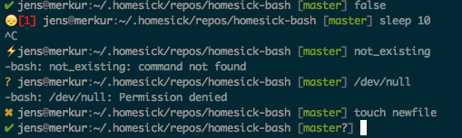

Homesick castle bash
====================

_This is a [homesick](https://github.com/technicalpickles/homesick) castle for [bash](http://www.bash.org/)._

Like many long term users of Linux/Unix/Mac, I have grown a fair amount of dot-files (```.vimrc```, ```.bashrc```, ```.muttrc```, ...) over the time. Each tailored to my specific needs, e.g with a ```git``` enabled prompt, and custom colours. 


*Linux*


*MacOS X*

As long, as there was only one (main) machine, this was good and well. As the complexity of the dotfiles grew, so did the number of machines/virtual machines I wanted these settings to be used on. I started copying over files. Then I switched to plain git to keep the history, and to rollback changes.  Later I switched to [homesick](https://github.com/technicalpickles/homesick).

More machines also meant more environments/operating-systems. Throwing in somewhat special systems like Solaris or MacOS, my dotfiles got littered with ```if ... then ... else``` and ```case``` statements.

Things got worse when the systems had different roles, or were configured for different environments. Say I did not want my personal ```.muttrc``` on my company machine. Or I wanted to configure ```$PATH``` different for a specific system.

Long story short: I have been through that, and wrote a bunch of scripts that help me to keep things organized.

<!--more-->

* A homesick castles (repository) called [homesick-bash](https://github.com/neuhalje/homesick-bash).
* A system of homesick [castles](https://github.com/neuhalje/homesick-vim) [grouped](https://github.com/neuhalje/homesick-tmux) [around](https://github.com/neuhalje/homesick-bash-mark_jump) it.

This system allows me to

* Keep settings separtated by tool (e.g. vim, tmux) in dedicated castles. A hooking mechanism allows different castles (```plugins```) to hook into ```.bashrc```
* Keep OS/distro -dependant things factored out in isolated files (if I want to)
* Keep everything in sync over multiple machines (```homesick_update```, ```homesick_local_changes``` -- see below for an example)
* Have OS specific callbacks in .bashrc
* Have machine specific callbacks in .bashrc
* Have a [Solarized](http://ethanschoonover.com/solarized) color scheme in my terminal (and [vim](https://github.com/neuhalje/homesick-vim))
* Have it running on Debian, MacOS, Solaris 11 (beta), and SmartOS (beta).

I [shared the code](https://github.com/neuhalje/homesick-bash) via GitHub. Sensitive information (castles) is kept in my own git repositories at home.

How?
=====

If you are interested in doing the same, you'll need around 10-15 minutes. The process is very straigthforward, and is summarised in the steps:


1. Install homesick
2. Prepare a plugin for your existing ```.bashrc```
3. Backup ```.profile``` to ```.profile.backup```
4. Clone ```homesick-bash```
5. Create a host specific castle (optional)
6. Integrate your ```.profile``` (manual setup)
7. Push your local repositories to your git server (optional)

All steps, except the last two, are scripted below.

Install
------
```bash
cd ~
sudo gem install homesick
homesick clone git://github.com/neuhalje/homesick-bash.git


# Convert .bashrc to a plugin-castle.
mkdir .homesick
cd ~/.homesick

homesick generate homesick-bashrc
mkdir -p homesick-bashrc/home/.bashrc-plugin.original_bashrc.d/common


mv ~/.bashrc homesick-bashrc/home/.bashrc-plugin.original_bashrc.d/common/plugin.conf
cd homesick-bashrc
git add -u .
git commit -m"~.bashrc"

cd ~

# Edit .profile later
mv .profile .profile.backup

homesick symlink homesick-bashrc
homesick symlink homesick-bash

# It is important to source the .bashrc to setup BASHRC_HOST_CONFIG
. .bashrc

# Create system specific castle

homesick generate .homesick/repos/homesick-system-${BASHRC_HOST_CONFIG}
touch ~/.homesick/repos/homesick-system-${BASHRC_HOST_CONFIG}/home/.bashrc.${BASHRC_HOST_CONFIG}.d/path
touch ~/.homesick/repos/homesick-system-${BASHRC_HOST_CONFIG}/home/.bashrc.${BASHRC_HOST_CONFIG}.d/exports
touch ~/.homesick/repos/homesick-system-${BASHRC_HOST_CONFIG}/home/.bashrc.${BASHRC_HOST_CONFIG}.d/alias

# The castle is a git repository
cd ~/.homesick/repos/homesick-system-${BASHRC_HOST_CONFIG}/

cat <<EOF>README.md
README
-------
Castle for ${BASHRC_HOST_CONFIG}. See https://github.com/neuhalje/homesick-bash for docs.
EOF

git add home/.bashrc.${BASHRC_HOST_CONFIG}.d/*
git add README.md

git commit -m"1st commit"

cd -

homesick symlink homesick-system-${BASHRC_HOST_CONFIG}

echo Now you can add a remote (AKA backup) for your repository
echo cd .homesick/repos/homesick-system-${BASHRC_HOST_CONFIG}
echo git add remote origin ..
echo git push -u origin master


# now log out of the shell and back in to source .bashrc again with the machine specific settings.
echo Please edit .profile.backup, it is no longer sourced
```


Usage
------

Use the repo with ```homesick```: 

```bash
homesick clone ssh://git@github.com:neuhalje/homesick-bash.git
homesick symlink homesick-bash
```

**My castles**: ```homesickdir``` takes you to ```~/.homesick/repos/```.

**Updating**: ```homesick_update``` automatically calls ```homesick pull``` and ```homesick symlink``` for all homesick castles in ```~/.homesick/repos/```.

**Checking for local modifications**:

```bash
$  homesick_local_changes  # also supports a -v flag
Looking for local modifications in your castles...
* homesick-bash
- there are some changed files
* homesick-git
* homesick-mail-base
- there are some untracked files
* homesick-mail-jens_home
* homesick-screen
* homesick-system-merkur
* homesick-vim
```

**Copy setup no new machine**: ```homesick_export``` prints instructions to do so, e.g.

```bash
$ homesick_export

# homesick-bash
homesick clone ssh://git@github.com:neuhalje/homesick-bash.git
homesick symlink homesick-bash

# homesick-git
homesick clone ssh://git@github.com:neuhalje/homesick-git.git
homesick symlink homesick-git

# homesick-mail-base
homesick clone ssh://git@github.com:neuhalje/homesick-mail-base.git
homesick symlink homesick-mail-base

# ...

# homesick-tmux
homesick clone ssh://git@github.com:neuhalje/homesick-tmux.git
homesick symlink homesick-tmux

# homesick-vim
homesick clone ssh://git@github.com:neuhalje/homesick-vim.git
homesick symlink homesick-vim
```


Includes
--------

Includes are bash scripts that are sourced. First general scripts are sourced, then os specific, then distro specific, and finally hostname specific.

The order and locations of the files are:

1. ```~/.bashrc.os.d/common```
2. ```~/.bashrc.os.d/${BASHRC_OS}-common```
3. ```~/.bashrc.os.d/${BASHRC_OS}-${BASHRC_OS_DISTRO}```
4. ```~/.bashrc.${BASHRC_HOST_CONFIG}.d``` where BASHRC_HOST_CONFIG is the node name without the domain part.

The files included are, in the following order:

* ```bgcolor```     -- set ```COLOR_BG_IS``` to either ```DARK``` or ```LIGHT```, dpendening on whether the terminal BG is light or dark. *Default:* ```DARK```
* ```colors```      -- *internal* create color tables
* ```main```        --~
* ```path```        -- Augement the path
* ```alias```       -- Define ```alias```es.
* ```exports```     -- Keep exports togehter

* ```bashprompt```  -- *internal* Set up the bashprompt

### Plugins
Plugins AKA other castles can hook into the sourcing lifecycle by providing a file matching the glob ```~/.bashrc-plugin.*.d```. ```.bashrc``` will source the file ```plugin.conf``` according to the rules described above.


### Example

On the system ```home``` which is an Ubuntu system, while sourcing ```.bashrc``` the following ```alias``` files are sourced in the following order (if they exist):

1. ```~/.bashrc.os.d/common/alias```
2. ```~/.bashrc.os.d/linux-common/alias```
3. ```~/.bashrc.os.d/linux-debian/alias```
4. ```~/.bashrc.home.d/alias```

If a directory ```~/.bashrc-plugin.myplugin.d``` exists, then the following files would be sourced as well (if they exist):

1. ```~/.bashrc-plugin.myplugin.d/common/plugin.conf```
2. ```~/.bashrc-plugin.myplugin.d/linux-common/plugin.conf```
3. ```~/.bashrc-plugin.myplugin.d/linux-debian/plugin.conf```
4. ```~/.bashrc.home.d/myplugin.conf```

### Debugging

Logging can be enabled in ```.bashrc``` by setting ```DEBUG=1```.


Variables
---------

### Common

* ```BASHRC_HOST_CONFIG``` -  The hostname used for host-specific configuration files. Defined in ```.bashrc```. *Exported*
* ```BASHRC_ALREADY_CONFIGURED``` - Has ```.bashrc``` already been sourced? Set to ```yes``` if so. Defined in ```.bashrc```.

### OS dependend

* ```BASHRC_OS``` -- The OS running. Values for BASHRC_OS are:
     * ```aix```     -- AIX
     * ```darwin```  -- MacOS X
     * ```linux```   -- Linux
     * ```smartos``` -- joyent SmartOS
     * ```solaris``` -- Sun Solaris
     * ```windows``` -- Windows

* ```BASHRC_OS_DISTRO``` -- The distro running (only set for Linux). Values for BASHRC_OS_DISTRO are:
     * ```debian``` (also on Ubuntu)
     * ```mandrake```
     * ```redhat```
     * ```suse```


Functions
----------

### Internal
* ```bashrc_determine_os``` defined in detect_os. Sets BASHRC_OS and BASHRC_OS_DISTRO.


Colors
--------

To make the shell more colorfull the castle provides some color-codes that can be used in shell-scripts. For a description of the color codes see Ethan Schoonovers [Solarized page](http://ethanschoonover.com/solarized).

### Usage

```bash
 echo -e ${SOL_RED}red ${SOL_GREEN}green ${NO_COLOUR}blank ${SOL_EMPH}important ${SOL_BODY_TXT}normal ${SOL_COMMENT}unimportant
```

### Codes

The following codes exist:

**Text types**:

* ```SOL_EMPH```      - Text with emphasis, depends on the value of ```COLOR_BG_IS```.
* ```SOL_BODY_TXT```  - Normal text, depends on the value of ```COLOR_BG_IS```.
* ```SOL_COMMENT```   - Comments (lighter), depends on the value of ```COLOR_BG_IS```.
* ```NO_COLOUR```     - No color

**Colors**:

* ```SOL_YELLOW```
* ```SOL_ORANGE```
* ```SOL_RED```
* ```SOL_MAGENTA```
* ```SOL_VIOLET```
* ```SOL_BLUE```
* ```SOL_CYAN```
* ```SOL_GREEN```

**Solarized base colors**

* ```SOL_BASE03```
* ```SOL_BASE02```
* ```SOL_BASE01```
* ```SOL_BASE00```
* ```SOL_BASE0```
* ```SOL_BASE1```
* ```SOL_BASE2```
* ```SOL_BASE3```

